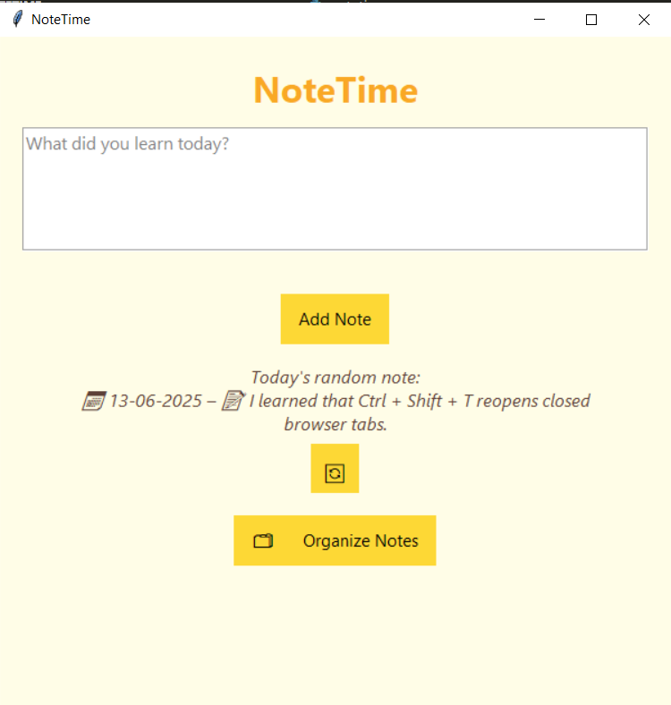

# notetime

A minimal Python CLI tool to capture what you’ve learned each day and revisit past notes randomly.  
Designed to preserve valuable knowledge and prevent it from fading over time.

---

## Why?

We learn something valuable almost every day — a new concept, a better approach, a subtle bug fix. But too often, those insights slip away, lost to time and busy routines.

**NoteTime** is a lightweight way to preserve those small but meaningful moments of understanding.  
By capturing what you've learned each day and revisiting it randomly later, you build a quiet archive of knowledge — one that’s easy to forget, but too valuable to lose.

## 🚀 Quick Start

1. Open your Terminal.

2. Use git clone https://github.com/your-username/notetime.git to install NoteTime on your machine.

3. Enter the notetime folder.

4. Run python notizen.py.

## Usage

After starting NoteTime with `python notizen.py`, you will be prompted with:

**"What did you learn today?"**

Simply type your note and press Enter. Your input is saved automatically in the `notes.db` SQLite database, which is created by the program if it doesn't exist.

Each time you run the program, a random previous note will be shown to help you recall past learnings.

There are no additional commands or options yet—just enter your daily insights and review past notes effortlessly.  
As soon as new features are added, you’ll find them here. Stay tuned!

try me new gui version as well with: python notetime.py --gui

## 🤝 Contributing

Use the Quick Start guide above to try NoteTime yourself.

If you have feedback, ideas, or want to contribute, feel free to contact me on GitHub!

Pull requests are welcome — just fork the repo and open a PR to the `main` branch.

Let’s improve this project together!

